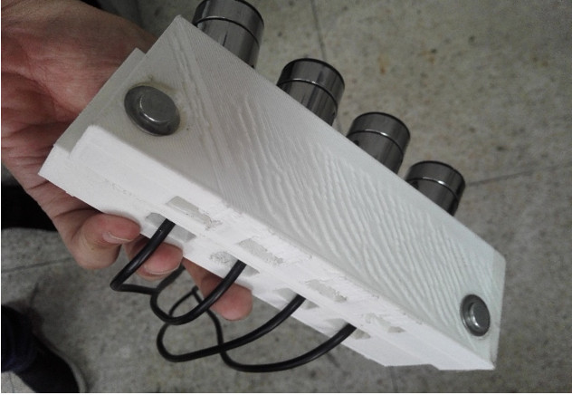
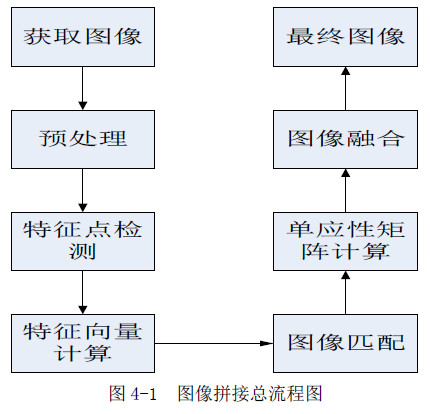
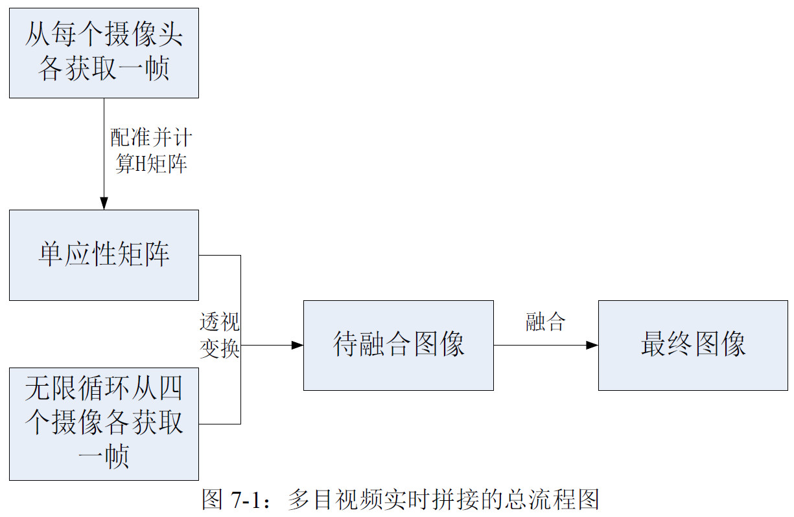

# 多目相机的视频拼接

本项目源于本科导师安排的毕业设计，本应该16年就整理完成，一直拖到2018年5月才有时间整理并分享。其中走的弯路较多，并且这一方面的资料较少，大多数类似项目完成之后就申请专利并没有开源。本次项目文档按照以下3个部分展开：

1. 设计目标
2. 环境搭建
3. 设计思路

# 设计目标

多目相机的视频拼接技术是指利用多目相机或相机阵列进行大尺寸视频拼接。类似于昆虫复眼。即虽然单相机功能较弱，但利用多台相机同时拍摄，则可以弥补单台相机的不足。

本项目的主要研究内容是基于多目相机，利用图像拼接技术实现大尺寸图像的合成，然后在此基础上，利用多幅图像之间的空间关联，计算单应矩阵，通过图像融合的手段实现大尺寸视频的合成。

本设计要求完成：

1. 熟悉OpenCV基本函数的使用；
2. 搭建Qt+OpenCV开发环境；
3. 熟悉软件编写流程；
4. 掌握多目相机的视频拼接的核心步骤和相关算法
5. 设计并实现图像拼接和视频拼接算法的演示软件；
6. 测试多个摄像头多组视频拼接结果。

# 环境搭建

软件方面：采用`C++`+`Qt5.5.1`+`OpenCV2.4.9`

硬件方面：

- 摄像头：采用淘宝上最便宜的小钢炮摄像头，单个价格25元左右
- 摄像头固定装置：计算摄像头的视场，使用`Autodesk 3ds Max`设计固定装置，并使用3D打印技术打印

硬件设备类似如下

# 设计思路

图像拼接是视频拼接的核心技术，目前图像拼接技术大体可以分为三个步骤：图像的预处理、图像配准、和图像融合。而图像拼接研究的难点就是图像配准和图像融合。详细步骤如下图：

因为我们设计的相机阵列中的所有的相机设备之间的相对位置是固定不变的，因此任意两幅有重叠区域的图像之间计算得出的透视变换矩阵也是一样的，至少是非常接近的。为了保证视频拼接的实时性和准确性，与一般的视频拼接的方法相比较，我们最终采取的视频拼接的方法如下四步：

1. 我们只需要从四个视频图像中捕获比较合适的图像，保存下来。
2. 根据第一步的图像进行配准操作，
3. 计算出四个摄像头图像之间的单应性矩阵，并且并存储在一个Mat 里面。
4. 在剩下的那些需要实时拼接的视频帧，就可以直接调用存储在Mat 中的单应性矩阵，从而完成配准过程。

这样剩下的那些需要实时拼接的视频帧在拼接的时候就可以省去每次的特征提取配准的时间。只需利用透视变换矩阵进行图像变换拼接和图像融合两个步骤。

整个视频拼接的步骤如下：

# 最后

大致的README文档就到此结束，具体内容请参见代码和paper下面的论文。